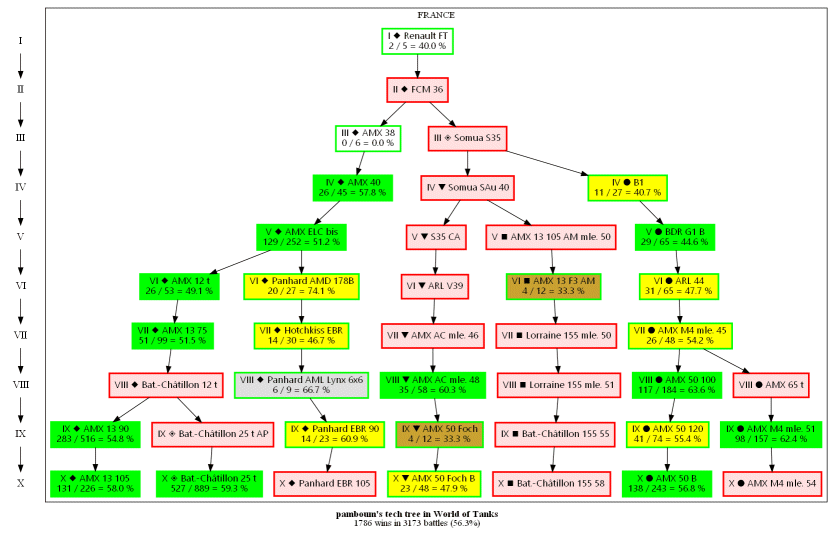

# Player's tech tree in World of Tanks

## Introduction

This script calls the API of [World of Tanks](https://eu.wargaming.net/en/games/wot) to retrieve the tech tree of a given player. Then, it produces a picture with some basic statistics that will help you to understand the path followed by the player.

Climbing the tech tree can be very long. However some streamers have many mechanics of tier X. How did they managed to do so ? That tool is very interesting to understand the underlying logic and the habits of a player.

## Setup

- Install [Python](https://www.python.org)
- Install [GraphViz](https://graphviz.org/download/) or use the online service [VizJS](http://viz-js.com)
- Register at [WarGaming](https://developers.wargaming.net) with your phone to get a personal application ID
- Modify `wot.py` to put the application identifier in `APP_ID`

## Usage

- Run the script: `python wot.py --server eu --player Pamboum --language en pamboum.png`
	- The parameters with `--` are optional
- The generated file `.gv` is the definition of the graph
- The generated picture is the one from the command line

## Preview

The final picture looks like this :

